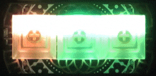

# colorwheels

An Endless Color Generator

This project is a continuous color generator for Python. We create a palette of a specific color range, a palette of matching colors and similar to serve to a consumer application. 

Works great when generating rainbow effects in hobby electronics (RGB LEDs, RGB Panels), and elsewhere. The idea behind is an endless colorwheel for photographers - the wheel continuously turns around to generate the next color.

Here's an example of colorwheels on a keybow, waiting for a keypress.



All in a few lines of code:

```python

# wheel is initialized and definitions loaded
while True:
    color = wheel.next()
    keybow.set_led(9, color[0], color[1], color[2])
    keybow.show()
    time.sleep(0.1)
```

## Links

* [GitHub](https://github.com/quantumspaces/colorwheels)
* [PyPi](https://pypi.org/project/colorwheels/)
* [Read The Docs](https://colorwheels.readthedocs.io/en/latest/)

## About

We are a maker community in Karlskrona, Sweden. We run makerspaces every week, working with Raspberry Pis, Arduinos and other interesting hardware.

This repository is here to support our community of makers. A lot of our achievements are based and inspired by the community at large. We wish to pay back and share our experiences and lessons learned.
