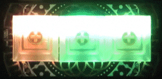

***********************
Welcome to Colorwheels!
***********************

ColorWheels - An Endless Color Generator
========================================

This project is a continuous color generator for Python. The idea is to continuously serve a sequence of colors to your application, in any desired format.

We use the package for easy color handling in our electronics projects on Raspberry Pi (RGB LEDs, RGB Panels and other). This doesn't limit the use of course, use it anywhere you like!

The idea behind is an endless colorwheel for photographers - the wheel continuously turns around to generate the next color - and ideally, colors have a continuity when starting all over.

We have also bundled an easy configuration handling, via YAML files (see :doc:`yaml_definitions`). Define your color palettes and patterns in a script file and separate color definitions from code. Then re-use. Apart from standard color sequences, we've added color generators - as of this writing, Rainbow effect generators are available.

If you're wondering how hard is to use colorwheels on a keybow (shown above), here's the code snippet - this loop ensures a rainbow effect on a button, which awaits a keypress.

.. code-block:: python

   # wheel is initialized and definitions loaded or generated
   while True:
      color = wheel.next()
      keybow.set_led(9, color[0], color[1], color[2])
      keybow.show()
      time.sleep(0.1)

We have a small tutorial available as well. Go to the section :doc:`using_colorwheels` to get started.

.. toctree::
   :maxdepth: 2
   :caption: Getting Started

   using_colorwheels
   color_handling
   yaml_definitions

.. toctree::
   :maxdepth: 2
   :caption: Modules

   colorwheels
   colorwheels_config
   color_item
   wheel_item

Indices and tables
==================

* :ref:`genindex`
* :ref:`modindex`
* :ref:`search`
