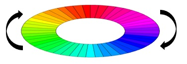

***********************
Welcome to Colorwheels!
***********************

ColorWheels - An Endless Color Generator
========================================

This project is a continuous color generator for Python. We create a palette of a specific color range, a palette of matching colors and similar to serve to a consumer application. 

You can use Colorwheels to generate repeating patterns of colors or create Rainbow effects for your applications. Works great for handling color in hobby electronics (RGB LEDs, RGB Panels), and elsewhere. The idea behind is an endless colorwheel for photographers - the wheel continuously turns around to generate the next color.

.. toctree::
   :maxdepth: 2
   :caption: Getting Started

   using_colorwheels
   color_handling
   yaml_definitions

.. toctree::
   :maxdepth: 2
   :caption: Modules

   colorwheels
   colorwheels_config
   color_item
   wheel_item

Indices and tables
==================

* :ref:`genindex`
* :ref:`modindex`
* :ref:`search`
